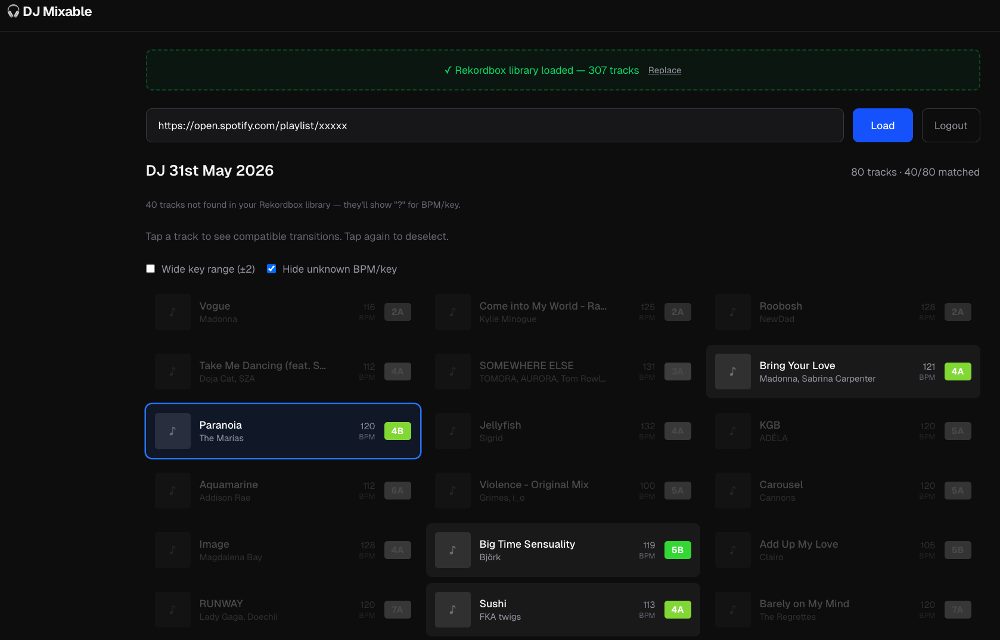

# DJ Mixable — Transition Helper

A web app for DJs to find smooth transitions between tracks. Load a Spotify playlist, optionally import your Rekordbox library for accurate BPM/key data, then tap any track to instantly see which others are compatible based on **BPM (±6%)** and **Camelot key** compatibility.


*Album artwork is shown in the actual app — omitted here for copyright reasons.*

## Features

- **Spotify playlist loading** — paste any Spotify playlist URL to pull in tracks with metadata
- **Rekordbox library import** — drag & drop your Rekordbox XML or TXT export for precise BPM/key values
- **Camelot wheel matching** — highlights compatible keys (same key, ±1 position, parallel major/minor)
- **BPM tolerance** — filters tracks within ±6% tempo range
- **Instant filtering** — tap a track to highlight compatible transitions; incompatible tracks are grayed out
- **Spotify OAuth** — uses Authorization Code flow to access your playlists

## Getting Started

### Prerequisites

- Node.js 18+
- A [Spotify Developer](https://developer.spotify.com/dashboard) app with `SPOTIFY_CLIENT_ID` and `SPOTIFY_CLIENT_SECRET`

### Setup

1. Clone the repo and install dependencies:

   ```bash
   npm install
   ```

2. Create `.env.local` with your Spotify credentials:

   ```
   SPOTIFY_CLIENT_ID=your_client_id
   SPOTIFY_CLIENT_SECRET=your_client_secret
   ```

3. Start the dev server:

   ```bash
   npm run dev
   ```

4. Open [http://localhost:3000](http://localhost:3000)

## Usage

1. **Log in** with your Spotify account
2. **(Optional)** Import your Rekordbox library — drag & drop an XML export (File → Export Collection in xml) or TXT (select tracks → right-click → copy)
3. **Paste** a Spotify playlist URL and click **Load**
4. **Tap** any track to see which others are compatible for transitions

Tracks matched to your Rekordbox library use its BPM/key data. Unmatched tracks show "?" for BPM and key.

## Tech Stack

- **Next.js 16** (App Router) + TypeScript
- **Tailwind CSS 4**
- **Vitest** for testing

## Scripts

| Command | Description |
| --- | --- |
| `npm run dev` | Start dev server |
| `npm run build` | Production build |
| `npm run start` | Start production server |
| `npm run lint` | Run ESLint |
| `npm test` | Run tests |
| `npm run test:watch` | Run tests in watch mode |

## Project Structure

```
app/
  page.tsx              # Main page (playlist input, Rekordbox upload, track list)
  api/
    auth/               # Spotify OAuth (login, callback, logout, status)
    playlist/            # Fetch & merge playlist tracks
    rekordbox/           # Rekordbox library upload & status
components/
  TrackCard.tsx          # Individual track card with visual states
  TrackList.tsx          # Track grid with selection & filtering logic
lib/
  camelot.ts             # Camelot wheel mapping & compatibility checks
  rekordbox.ts           # Rekordbox XML/TXT parser
  rekordbox-store.ts     # Server-side Rekordbox library storage
  spotify.ts             # Spotify API client (auth, playlist, audio features)
  types.ts               # Shared TypeScript types
```
